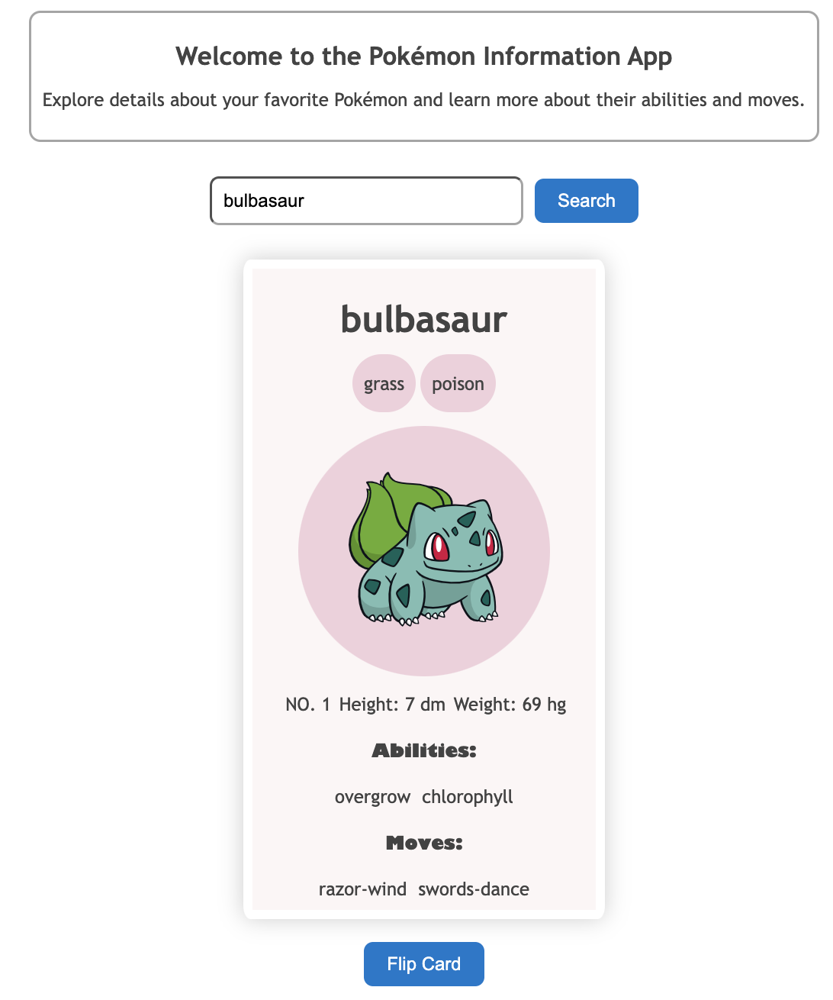

# Pokémon Webapplikasjon

Dette er en React-basert webapplikasjon som lar brukere søke etter Pokémon ved hjelp av API’et [pokeApi](https://pokeapi.co/)

## Funksjonalitet
- **Søk etter Pokémon:** Brukere kan skrive inn navnet på en Pokémon i et inputfelt og deretter trykke på "Søk" -knappen for å hente informasjon om den spesifikke Pokémonen.

- **Flip Card:** Når informasjonen om Pokémon vises, kan brukere trykke på "Flip Card" -knappen for å vise baksiden av Pokémon-kortet, som inneholder et bilde av Pokémon.

### Screenshot

## Tilgjenglige Scripts

I denne prosjektmappen, kan du kjøre:

### `yarn install`
Installerer alle nødvendige pakker og avhengigheter

### `yarn start`

Kjører appen i utviklingsmodus.\
Du kan åpne [http://localhost:3000](http://localhost:3000) for å se appen i nettlesern din.

